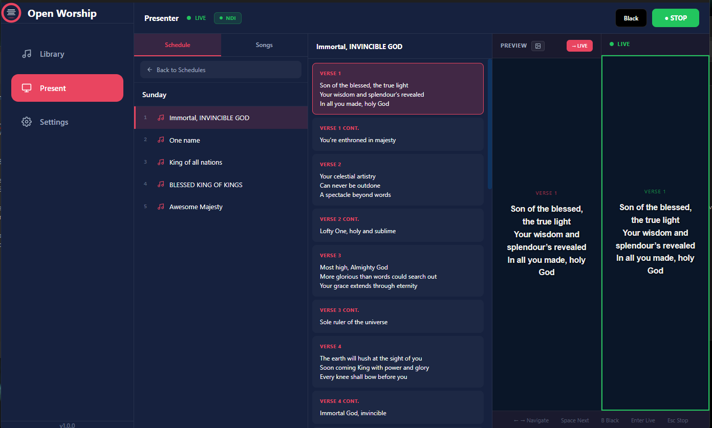

# Getting Started
{: .fs-9 }

Install Open Worship and get your first service running in minutes.
{: .fs-6 .fw-300 }

---

## Download & Install

### Windows

1. Download [Open-Worship-1.0.0-Setup.exe](https://github.com/inno8/open-worship/releases)
2. Run the installer and follow the prompts
3. Launch **Open Worship** from the Start Menu

{: .note }
Windows may show a SmartScreen warning since the app isn't code-signed. Click **More info** → **Run anyway**.

### macOS

1. Download [Open-Worship-1.0.0.dmg](https://github.com/inno8/open-worship/releases)
2. Open the DMG and drag **Open Worship** to Applications
3. Right-click the app → **Open** (first time only, to bypass Gatekeeper)

### Linux

1. Download [Open-Worship-1.0.0.AppImage](https://github.com/inno8/open-worship/releases)
2. Make it executable: `chmod +x Open-Worship-1.0.0.AppImage`
3. Run it: `./Open-Worship-1.0.0.AppImage`

Or install the `.deb` package on Debian/Ubuntu:
```bash
sudo dpkg -i open-worship_1.0.0_amd64.deb
```

---

## First Launch

When you open Open Worship for the first time, you'll see three main sections:

| Section | Purpose |
|:--------|:--------|
| **Library** | Manage your song collection |
| **Present** | Run live presentations |
| **Settings** | Configure output, fonts, colors, NDI |

---

## Add Your First Song

1. Click **Library** in the sidebar
2. Click **+ Add Song**
3. Enter the song title
4. Add lyrics in the content area

### Formatting Tips

Use section markers to organize your lyrics:

```
[Verse 1]
Amazing grace, how sweet the sound
That saved a wretch like me

[Chorus]
I once was lost, but now am found
Was blind, but now I see
```

Supported markers:
- `[Verse 1]`, `[Verse 2]`, etc.
- `[Chorus]`
- `[Bridge]`
- `[Pre-Chorus]`
- `[Outro]`
- `[Tag]`

---

## Create a Schedule

1. Click **Present** in the sidebar
2. Click **← Back to Schedules**
3. Create a new schedule (e.g., "Sunday Service")
4. Click **Add to Schedule** on songs from your library

Your schedule will appear in the **Present** view, ready for the service.

---

## Go Live



1. Select your schedule in the **Present** view
2. Click a song to open it
3. Click any verse in the center panel to **preview** it
4. Press **Enter** or click **→ LIVE** to send to output
5. Use **Space** to advance to the next slide

### Controls

| Control | Action |
|:--------|:-------|
| **Space** | Next slide |
| **←** / **→** | Previous / Next slide |
| **B** | Black screen |
| **Esc** | Stop live output |

See [Keyboard Shortcuts](keyboard-shortcuts) for the full list.

---

## Configure Settings


Click **Settings** to customize:

### Appearance
- **Font Family** — Choose your display font
- **Font Size** — Adjust for your screens (default: 62px)
- **Font Weight** — Light to bold
- **Text Color** — White works best on dark backgrounds

### NDI Output
- **Enable NDI** — Broadcast lyrics over NDI for OBS/vMix
- **Source Name** — Identifies your output on the network
- **Text Position** — Center (full screen) or Lower Third (OBS overlay)

See [NDI & OBS Setup](ndi-obs-setup) for livestream integration.

---

## Next Steps

- [User Guide](user-guide) — Explore all features
- [Adding Songs](adding-songs) — Import and organize your library
- [NDI & OBS Setup](ndi-obs-setup) — Set up livestream overlays
- [Keyboard Shortcuts](keyboard-shortcuts) — Master the controls
